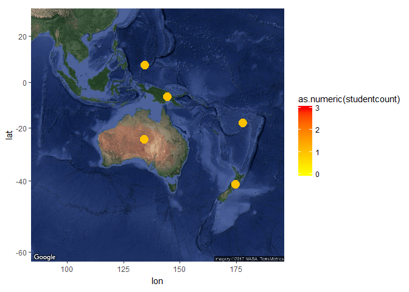
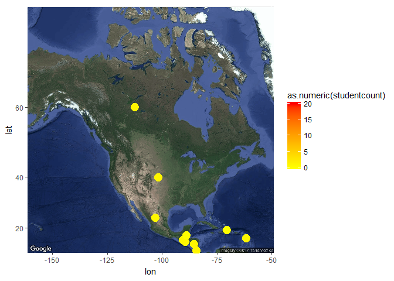

台灣旅遊與僑生來台就學
================

組員姓名
--------

資管二甲 B0344122 楊守仁

分析議題背景
------------

從網路上的open data收集了歷年來台旅客的國藉及現時台灣各大專院校外藉學生等資料從而了解台灣的風光和旅遊，有沒有帶起外國人對台灣的興趣並且來台就/升學。

分析動機
--------

作為外國長大的僑生的一分子，藉著這個機會了解「同是天涯淪落人」的留台外國人的在台灣甚至在長庚的狀況。

使用資料
--------

File\_1940是各級學校僑生資料 visitorstatictis1是自1956年以來來台旅客人數及國藉資料 Student\_RPT\_05是現時台灣各大專院校外藉學生資料包括人數國藉科系學制等資料

\*還有一份是"大專校院僑生及畢業生人數—按性別、校別與僑居地別分"資料，但資料尚有一些問題，所以尚未載入，但是連同作業一同commit

載入使用資料們

``` r
#這是R Code Chunk
library(readr)
```

    ## Warning: package 'readr' was built under R version 3.3.3

``` r
File_1940 <- read_csv("C:/CGUIM_BigData_FinalReport-B0344122/File_1940.csv", skip = 3)
```

    ## Warning: Missing column names filled in: 'X1' [1], 'X2' [2]

    ## Parsed with column specification:
    ## cols(
    ##   X1 = col_character(),
    ##   X2 = col_character(),
    ##   計 = col_character(),
    ##   `公私立
    ## 大　學` = col_character(),
    ##   `國防
    ## 醫學院` = col_character(),
    ##   `僑　生
    ## 先修部` = col_character(),
    ##   `專科
    ## 學校` = col_character(),
    ##   高國中 = col_character(),
    ##   `職業
    ## 學校` = col_character(),
    ##   國小 = col_integer(),
    ##   `各級
    ## 補校` = col_character(),
    ##   海青班 = col_integer()
    ## )

    ## Warning: 1 parsing failure.
    ## row # A tibble: 1 x 5 col     row   col   expected    actual expected   <int> <chr>      <chr>     <chr> actual 1     1  <NA> 12 columns 9 columns file # ... with 1 more variables: file <chr>

``` r
visitorstatictis1 <- read_csv("C:/CGUIM_BigData_FinalReport-B0344122/visitorstatictis1.csv")
```

    ## Warning: Missing column names filled in: 'X2' [2], 'X3' [3], 'X4' [4],
    ## 'X5' [5], 'X6' [6], 'X7' [7], 'X8' [8], 'X9' [9], 'X10' [10]

    ## Parsed with column specification:
    ## cols(
    ##   `Visitor  Arrivals, 1956-2015` = col_character(),
    ##   X2 = col_character(),
    ##   X3 = col_character(),
    ##   X4 = col_character(),
    ##   X5 = col_character(),
    ##   X6 = col_character(),
    ##   X7 = col_character(),
    ##   X8 = col_character(),
    ##   X9 = col_character(),
    ##   X10 = col_character()
    ## )

``` r
Student_RPT_05 <- read_csv("C:/CGUIM_BigData_FinalReport-B0344122/Student_RPT_05.csv")
```

    ## Warning: Missing column names filled in: 'X1' [1], 'X3' [3], 'X4' [4],
    ## 'X5' [5], 'X6' [6], 'X7' [7], 'X8' [8], 'X9' [9]

    ## Parsed with column specification:
    ## cols(
    ##   X1 = col_character(),
    ##   `05.僑生、港澳生數` = col_character(),
    ##   X3 = col_character(),
    ##   X4 = col_character(),
    ##   X5 = col_character(),
    ##   X6 = col_character(),
    ##   X7 = col_character(),
    ##   X8 = col_character(),
    ##   X9 = col_character(),
    ##   `僑生總計：` = col_character(),
    ##   `43833` = col_character(),
    ##   `僑生男：` = col_character(),
    ##   `21806` = col_character(),
    ##   `僑生女：` = col_character(),
    ##   `22027` = col_character()
    ## )

``` r
X104oversea_B1_1a <- read_csv("C:/CGUIM_BigData_FinalReport-B0344122/104oversea_B1-1a.csv")
```

    ## Parsed with column specification:
    ## cols(
    ##   學校代碼 = col_character(),
    ##   `學校名稱` = col_character(),
    ##   等級 = col_character(),
    ##   僑居地 = col_character(),
    ##   在學學生人數_男 = col_integer(),
    ##   在學學生人數_女 = col_integer(),
    ##   新生 = col_integer(),
    ##   舊生 = col_integer(),
    ##   上學年度畢業生人數_男 = col_integer(),
    ##   上學年度畢業生人數_女 = col_integer()
    ## )

``` r
library(readxl)
```

    ## Warning: package 'readxl' was built under R version 3.3.3

``` r
X100to105v1 <- read_excel("C:/CGUIM_BigData_FinalReport-B0344122/100to105v1.xlsx")

## 資料處理與清洗

#資料清洗

#File_1940清洗
names(File_1940)[1] <-"學年度"
names(File_1940)[2] <-"總計"
names(File_1940)[3] <-"計"
names(File_1940)[4] <-"公私立大學"
File_1940 <- File_1940[-1,]

#visitorstatictis1清洗
visitorstatictis1 <- visitorstatictis1[-1,]
visitorstatictis1 <- visitorstatictis1[-1,]
names(visitorstatictis1)[1] <-"year"
names(visitorstatictis1)[2] <-"pop"
names(visitorstatictis1)[3] <-"成長率"
names(visitorstatictis1)[4] <-"指數"
names(visitorstatictis1)[5] <-"外籍旅客人數"
names(visitorstatictis1)[6] <-"外籍旅客成長率"
names(visitorstatictis1)[7] <-"外籍旅客指數"
names(visitorstatictis1)[8] <-"華僑旅客人數"
names(visitorstatictis1)[9] <-"華僑旅客成長率"
names(visitorstatictis1)[10] <-"華僑旅客指數"

#Student_RPT_05清洗
Student_RPT_05$X1 <- NULL
Student_RPT_05 <- Student_RPT_05[-1,]
Student_RPT_05 <- Student_RPT_05[-1,]
Student_RPT_05 <- Student_RPT_05[-1,]
names(Student_RPT_05)[1] <-"year"
names(Student_RPT_05)[2] <-"typeofschool"
names(Student_RPT_05)[3] <-"學校類別"
names(Student_RPT_05)[4] <-"學校代碼"
names(Student_RPT_05)[5] <-"schoolname"
names(Student_RPT_05)[6] <-"系所代碼"
names(Student_RPT_05)[7] <-"Major"
names(Student_RPT_05)[8] <-"class"
names(Student_RPT_05)[9] <-"overseastudentcount"
names(Student_RPT_05)[10] <-"overseaMstudentcount"
names(Student_RPT_05)[11] <-"overseaFstudentcount"
names(Student_RPT_05)[12] <-"HKMacaustudentcount"
names(Student_RPT_05)[13] <-"HKMacauMstudentcount"
names(Student_RPT_05)[14] <-"HKMacauFstudentcount"

student101data<-Student_RPT_05[grepl("101",Student_RPT_05$"year"),]
student102data<-Student_RPT_05[grepl("102",Student_RPT_05$"year"),]
student103data<-Student_RPT_05[grepl("103",Student_RPT_05$"year"),]
student104data<-Student_RPT_05[grepl("104",Student_RPT_05$"year"),]
student105data<-Student_RPT_05[grepl("105",Student_RPT_05$"year"),]

#X100to105v1清洗
X100to105v1$locationy[X100to105v1$"國籍" == c("馬來西亞")] <- "3.137956"
```

    ## Warning: Unknown or uninitialised column: 'locationy'.

``` r
X100to105v1$locationx[X100to105v1$"國籍" == c("馬來西亞")] <- "101.687132"
```

    ## Warning: Unknown or uninitialised column: 'locationx'.

``` r
X100to105v1$locationy[X100to105v1$"國籍" == c("南非")] <- "-30.909670"
X100to105v1$locationx[X100to105v1$"國籍" == c("南非")] <- "24.259127"

X100to105v1$locationy[X100to105v1$"國籍" == c("加拿大")] <- "59.997026"
X100to105v1$locationx[X100to105v1$"國籍" == c("加拿大")] <- "-112.402012"

X100to105v1$locationy[X100to105v1$"國籍" == c("緬甸")] <- "21.415178"
X100to105v1$locationx[X100to105v1$"國籍" == c("緬甸")] <- "96.396717"

X100to105v1$locationy[X100to105v1$"國籍" == c("印尼")] <- "-4.381767"
X100to105v1$locationx[X100to105v1$"國籍" == c("印尼")] <- "122.293216"

X100to105v1$locationy[X100to105v1$"國籍" == c("日本")] <- "36.552849"
X100to105v1$locationx[X100to105v1$"國籍" == c("日本")] <- "138.307262"

X100to105v1$locationy[X100to105v1$"國籍" == c("菲律賓")] <- "14.598987"
X100to105v1$locationx[X100to105v1$"國籍" == c("菲律賓")] <- "120.983238"

X100to105v1$locationy[X100to105v1$"國籍" == c("新加坡")] <- "1.360033"
X100to105v1$locationx[X100to105v1$"國籍" == c("新加坡")] <- "103.868979"

X100to105v1$locationy[X100to105v1$"國籍" == c("泰國")] <- "13.748660"
X100to105v1$locationx[X100to105v1$"國籍" == c("泰國")] <- "100.492952"

X100to105v1$locationy[X100to105v1$"國籍" == c("英國")] <- "54.938086"
X100to105v1$locationx[X100to105v1$"國籍" == c("英國")] <- "-2.867684"

X100to105v1$locationy[X100to105v1$"國籍" == c("美國")] <- "39.739020"
X100to105v1$locationx[X100to105v1$"國籍" == c("美國")] <- "-101.620433"

X100to105v1$locationy[X100to105v1$"國籍" == c("阿根廷")] <- "-35.388441"
X100to105v1$locationx[X100to105v1$"國籍" == c("阿根廷")] <- "-65.392241"

X100to105v1$locationy[X100to105v1$"國籍" == c("南韓")] <- "37.592579"
X100to105v1$locationx[X100to105v1$"國籍" == c("南韓")] <- "126.975279"

X100to105v1$locationy[X100to105v1$"國籍" == c("紐西蘭")] <- "-41.299974"
X100to105v1$locationx[X100to105v1$"國籍" == c("紐西蘭")] <- "174.776852"

X100to105v1$locationy[X100to105v1$"國籍" == c("墨西哥")] <- "24.129376"
X100to105v1$locationx[X100to105v1$"國籍" == c("墨西哥")] <- "-102.917429"

X100to105v1$locationy[X100to105v1$"國籍" == c("巴西")] <- "-8.884431"
X100to105v1$locationx[X100to105v1$"國籍" == c("巴西")] <- "-55.488347"

X100to105v1$locationy[X100to105v1$"國籍" == c("巴拉圭")] <- "-23.269402"
X100to105v1$locationx[X100to105v1$"國籍" == c("巴拉圭")] <- "-58.462776"

X100to105v1$locationy[X100to105v1$"國籍" == c("越南")] <- "14.484540"
X100to105v1$locationx[X100to105v1$"國籍" == c("越南")] <- "108.360975"

X100to105v1$locationy[X100to105v1$"國籍" == c("肯亞")] <- "0.418065"
X100to105v1$locationx[X100to105v1$"國籍" == c("肯亞")] <- "37.868307"

X100to105v1$locationy[X100to105v1$"國籍" == c("西班牙")] <- "39.690189"
X100to105v1$locationx[X100to105v1$"國籍" == c("西班牙")] <- "-3.132226"

X100to105v1$locationy[X100to105v1$"國籍" == c("尼加拉瓜")] <- "12.891754"
X100to105v1$locationx[X100to105v1$"國籍" == c("尼加拉瓜")] <- "-85.188938"

X100to105v1$locationy[X100to105v1$"國籍" == c("巴拿馬")] <- "8.484368"
X100to105v1$locationx[X100to105v1$"國籍" == c("巴拿馬")] <- "-80.109248"

X100to105v1$locationy[X100to105v1$"國籍" == c("澳大利亞")] <- "-24.551857"
X100to105v1$locationx[X100to105v1$"國籍" == c("澳大利亞")] <- "134.182865"

X100to105v1$locationy[X100to105v1$"國籍" == c("貝里斯")] <- "16.77919"
X100to105v1$locationx[X100to105v1$"國籍" == c("貝里斯")] <- "-88.737792"

X100to105v1$locationy[X100to105v1$"國籍" == c("智利")] <- "-26.554819"
X100to105v1$locationx[X100to105v1$"國籍" == c("智利")] <- "-70.418818"

X100to105v1$locationy[X100to105v1$"國籍" == c("薩爾瓦多")] <- "13.784449"
X100to105v1$locationx[X100to105v1$"國籍" == c("薩爾瓦多")] <- "-89.230311"

X100to105v1$locationy[X100to105v1$"國籍" == c("哥斯大黎加")] <- "9.948630"
X100to105v1$locationx[X100to105v1$"國籍" == c("哥斯大黎加")] <- "-84.117774"

X100to105v1$locationy[X100to105v1$"國籍" == c("法國")] <- "46.410759"
X100to105v1$locationx[X100to105v1$"國籍" == c("法國")] <- "2.716875"

X100to105v1$locationy[X100to105v1$"國籍" == c("阿拉伯聯合大公國")] <- "23.681736"
X100to105v1$locationx[X100to105v1$"國籍" == c("阿拉伯聯合大公國")] <- "54.002147"

X100to105v1$locationy[X100to105v1$"國籍" == c("葉門")] <- "15.846800"
X100to105v1$locationx[X100to105v1$"國籍" == c("葉門")] <- "47.850653"

X100to105v1$locationy[X100to105v1$"國籍" == c("俄羅斯")] <- "62.240122"
X100to105v1$locationx[X100to105v1$"國籍" == c("俄羅斯")] <- "93.834839"

X100to105v1$locationy[X100to105v1$"國籍" == c("斐濟")] <- "-17.847725"
X100to105v1$locationx[X100to105v1$"國籍" == c("斐濟")] <- "178.013273"

X100to105v1$locationy[X100to105v1$"國籍" == c("厄瓜多")] <- "-1.418160"
X100to105v1$locationx[X100to105v1$"國籍" == c("厄瓜多")] <- "-78.294611"

X100to105v1$locationy[X100to105v1$"國籍" == c("埃及")] <- "26.528769"
X100to105v1$locationx[X100to105v1$"國籍" == c("埃及")] <- "29.858624"

X100to105v1$locationy[X100to105v1$"國籍" == c("巴布亞紐幾內亞")] <- "-6.441940"
X100to105v1$locationx[X100to105v1$"國籍" == c("巴布亞紐幾內亞")] <- "144.595518"

X100to105v1$locationy[X100to105v1$"國籍" == c("巴基斯坦")] <- "30.082631"
X100to105v1$locationx[X100to105v1$"國籍" == c("巴基斯坦")] <- "69.294945"

X100to105v1$locationy[X100to105v1$"國籍" == c("巴林")] <- "26.038782"
X100to105v1$locationx[X100to105v1$"國籍" == c("巴林")] <- "50.552011"

X100to105v1$locationy[X100to105v1$"國籍" == c("比利時")] <- "50.906237"
X100to105v1$locationx[X100to105v1$"國籍" == c("比利時")] <- "4.338898"

X100to105v1$locationy[X100to105v1$"國籍" == c("玻利維亞")] <- "-16.597679"
X100to105v1$locationx[X100to105v1$"國籍" == c("玻利維亞")] <- "-64.640097"

X100to105v1$locationy[X100to105v1$"國籍" == c("帛琉")] <- "7.517417"
X100to105v1$locationx[X100to105v1$"國籍" == c("帛琉")] <- "134.572796"

X100to105v1$locationy[X100to105v1$"國籍" == c("德國")] <- "51.064427"
X100to105v1$locationx[X100to105v1$"國籍" == c("德國")] <- "10.492793"

X100to105v1$locationy[X100to105v1$"國籍" == c("多米尼克")] <- "15.430178"
X100to105v1$locationx[X100to105v1$"國籍" == c("多米尼克")] <- "-61.360056"

X100to105v1$locationy[X100to105v1$"國籍" == c("柬埔寨")] <- "12.678917"
X100to105v1$locationx[X100to105v1$"國籍" == c("柬埔寨")] <- "104.855949"

X100to105v1$locationy[X100to105v1$"國籍" == c("科威特")] <- "29.323762"
X100to105v1$locationx[X100to105v1$"國籍" == c("科威特")] <- "47.414698"

X100to105v1$locationy[X100to105v1$"國籍" == c("黎巴嫩")] <- "34.114424"
X100to105v1$locationx[X100to105v1$"國籍" == c("黎巴嫩")] <- "35.884993"

X100to105v1$locationy[X100to105v1$"國籍" == c("寮國")] <- "19.526376"
X100to105v1$locationx[X100to105v1$"國籍" == c("寮國")] <- "102.532372"

X100to105v1$locationy[X100to105v1$"國籍" == c("馬拉威")] <- "-14.020457"
X100to105v1$locationx[X100to105v1$"國籍" == c("馬拉威")] <- "33.839299"

X100to105v1$locationy[X100to105v1$"國籍" == c("孟加拉")] <- "23.739765"
X100to105v1$locationx[X100to105v1$"國籍" == c("孟加拉")] <- "90.428802"

X100to105v1$locationy[X100to105v1$"國籍" == c("模里西斯")] <- "-20.158133"
X100to105v1$locationx[X100to105v1$"國籍" == c("模里西斯")] <- "57.503020"

X100to105v1$locationy[X100to105v1$"國籍" == c("秘魯")] <- "-10.770646"
X100to105v1$locationx[X100to105v1$"國籍" == c("秘魯")] <- "-76.089076"

X100to105v1$locationy[X100to105v1$"國籍" == c("瑞典")] <- "64.496659"
X100to105v1$locationx[X100to105v1$"國籍" == c("瑞典")] <- "17.217521"

X100to105v1$locationy[X100to105v1$"國籍" == c("瑞士")] <- "46.783748"
X100to105v1$locationx[X100to105v1$"國籍" == c("瑞士")] <- "7.925473"

X100to105v1$locationy[X100to105v1$"國籍" == c("沙烏地阿拉伯")] <- "23.899594"
X100to105v1$locationx[X100to105v1$"國籍" == c("沙烏地阿拉伯")] <- "45.433590"

X100to105v1$locationy[X100to105v1$"國籍" == c("斯里蘭卡")] <- "7.588220"
X100to105v1$locationx[X100to105v1$"國籍" == c("斯里蘭卡")] <- "80.696452"

X100to105v1$locationy[X100to105v1$"國籍" == c("泰國")] <- "13.741785"
X100to105v1$locationx[X100to105v1$"國籍" == c("泰國")] <- "100.499849"

X100to105v1$locationy[X100to105v1$"國籍" == c("委內瑞拉")] <- "7.073115"
X100to105v1$locationx[X100to105v1$"國籍" == c("委內瑞拉")] <- "-66.610604"

X100to105v1$locationy[X100to105v1$"國籍" == c("汶萊")] <- "4.540462"
X100to105v1$locationx[X100to105v1$"國籍" == c("汶萊")] <- "114.639758"

X100to105v1$locationy[X100to105v1$"國籍" == c("象牙海岸")] <- "7.643046"
X100to105v1$locationx[X100to105v1$"國籍" == c("象牙海岸")] <- "5.353685"

X100to105v1$locationy[X100to105v1$"國籍" == c("匈牙利")] <- "47.012069"
X100to105v1$locationx[X100to105v1$"國籍" == c("匈牙利")] <- "19.624482"

X100to105v1$locationy[X100to105v1$"國籍" == c("義大利")] <- "42.935020"
X100to105v1$locationx[X100to105v1$"國籍" == c("義大利")] <- "12.410020"

X100to105v1$locationy[X100to105v1$"國籍" == c("印度")] <- "22.683064"
X100to105v1$locationx[X100to105v1$"國籍" == c("印度")] <- "79.031203"

X100to105v1$locationy[X100to105v1$"國籍" == c("約旦")] <- "31.279142"
X100to105v1$locationx[X100to105v1$"國籍" == c("約旦")] <- "36.756995"

X100to105v1$locationy[X100to105v1$"國籍" == c("史瓦濟蘭")] <- "-26.577159"
X100to105v1$locationx[X100to105v1$"國籍" == c("史瓦濟蘭")] <- "31.451034"

X100to105v1$locationy[X100to105v1$"國籍" == c("多明尼加")] <- "18.910874"
X100to105v1$locationx[X100to105v1$"國籍" == c("多明尼加")] <- "-70.193544"

X100to105v1$locationy[X100to105v1$"國籍" == c("納米比亞")] <- "-22.325959"
X100to105v1$locationx[X100to105v1$"國籍" == c("納米比亞")] <- "16.942383"

X100to105v1$locationy[X100to105v1$"國籍" == c("荷蘭")] <- "52.356997"
X100to105v1$locationx[X100to105v1$"國籍" == c("荷蘭")] <- "4.894108"

X100to105v1$locationy[X100to105v1$"國籍" == c("宏都拉斯")] <- "14.058685"
X100to105v1$locationx[X100to105v1$"國籍" == c("宏都拉斯")] <- "-87.201599"

X100to105v1$locationy[X100to105v1$"國籍" == c("瓜地馬拉")] <- "14.642601"
X100to105v1$locationx[X100to105v1$"國籍" == c("瓜地馬拉")] <- "-90.498682"

X100to105v1$"地區"[X100to105v1$"國籍" == c("美國")] <- "北美洲"
X100to105v1$"地區"[X100to105v1$"國籍" == c("加拿大")] <- "北美洲"
X100to105v1$"地區"[X100to105v1$"國籍" == c("巴西")] <- "南美洲"
X100to105v1$"地區"[X100to105v1$"國籍" == c("墨西哥")] <- "南美洲"
X100to105v1$"地區"[X100to105v1$"國籍" == c("阿根廷")] <- "南美洲"

asiavisitordata<-X100to105v1[grepl("亞洲",X100to105v1$"地區"),]
eurovisitordata<-X100to105v1[grepl("歐洲",X100to105v1$"地區"),]
SAfricavisitordata<-X100to105v1[grepl("非洲",X100to105v1$"地區"),]
Oceaniavisitordata<-X100to105v1[grepl("大洋洲",X100to105v1$"地區"),]
NAvisitorvisitordata<-X100to105v1[grepl("北美洲",X100to105v1$"地區"),]
SAvisitordata<-X100to105v1[grepl("南美洲",X100to105v1$"地區"),]

#X104oversea_B1_1a清洗
names(X104oversea_B1_1a)[2] <-"school"
names(X104oversea_B1_1a)[4] <-"country"
X104oversea_B1_1a$locationy[X104oversea_B1_1a$"country" == c("馬來西亞")] <- "3.137956"
```

    ## Warning: Unknown or uninitialised column: 'locationy'.

``` r
X104oversea_B1_1a$locationx[X104oversea_B1_1a$"country" == c("馬來西亞")] <- "101.687132"
```

    ## Warning: Unknown or uninitialised column: 'locationx'.

``` r
X104oversea_B1_1a$locationy[X104oversea_B1_1a$"country" == c("南非")] <- "-30.909670"
X104oversea_B1_1a$locationx[X104oversea_B1_1a$"country" == c("南非")] <- "24.259127"

X104oversea_B1_1a$locationy[X104oversea_B1_1a$"country" == c("加拿大")] <- "59.997026"
X104oversea_B1_1a$locationx[X104oversea_B1_1a$"country" == c("加拿大")] <- "-112.402012"

X104oversea_B1_1a$locationy[X104oversea_B1_1a$"country" == c("緬甸")] <- "21.415178"
X104oversea_B1_1a$locationx[X104oversea_B1_1a$"country" == c("緬甸")] <- "96.396717"

X104oversea_B1_1a$locationy[X104oversea_B1_1a$"country" == c("印尼")] <- "-4.381767"
X104oversea_B1_1a$locationx[X104oversea_B1_1a$"country" == c("印尼")] <- "122.293216"

X104oversea_B1_1a$locationy[X104oversea_B1_1a$"country" == c("日本")] <- "36.552849"
X104oversea_B1_1a$locationx[X104oversea_B1_1a$"country" == c("日本")] <- "138.307262"

X104oversea_B1_1a$locationy[X104oversea_B1_1a$"country" == c("菲律賓")] <- "14.598987"
X104oversea_B1_1a$locationx[X104oversea_B1_1a$"country" == c("菲律賓")] <- "120.983238"

X104oversea_B1_1a$locationy[X104oversea_B1_1a$"country" == c("新加坡")] <- "1.360033"
X104oversea_B1_1a$locationx[X104oversea_B1_1a$"country" == c("新加坡")] <- "103.868979"

X104oversea_B1_1a$locationy[X104oversea_B1_1a$"country" == c("泰國")] <- "13.748660"
X104oversea_B1_1a$locationx[X104oversea_B1_1a$"country" == c("泰國")] <- "100.492952"

X104oversea_B1_1a$locationy[X104oversea_B1_1a$"country" == c("英國")] <- "54.938086"
X104oversea_B1_1a$locationx[X104oversea_B1_1a$"country" == c("英國")] <- "-2.867684"

X104oversea_B1_1a$locationy[X104oversea_B1_1a$"country" == c("美國")] <- "39.739020"
X104oversea_B1_1a$locationx[X104oversea_B1_1a$"country" == c("美國")] <- "-101.620433"

X104oversea_B1_1a$locationy[X104oversea_B1_1a$"country" == c("阿根廷")] <- "-35.388441"
X104oversea_B1_1a$locationx[X104oversea_B1_1a$"country" == c("阿根廷")] <- "-65.392241"

X104oversea_B1_1a$locationy[X104oversea_B1_1a$"country" == c("南韓")] <- "37.592579"
X104oversea_B1_1a$locationx[X104oversea_B1_1a$"country" == c("南韓")] <- "126.975279"

X104oversea_B1_1a$locationy[X104oversea_B1_1a$"country" == c("紐西蘭")] <- "-41.299974"
X104oversea_B1_1a$locationx[X104oversea_B1_1a$"country" == c("紐西蘭")] <- "174.776852"

X104oversea_B1_1a$locationy[X104oversea_B1_1a$"country" == c("墨西哥")] <- "24.129376"
X104oversea_B1_1a$locationx[X104oversea_B1_1a$"country" == c("墨西哥")] <- "-102.917429"

X104oversea_B1_1a$locationy[X104oversea_B1_1a$"country" == c("巴西")] <- "-8.884431"
X104oversea_B1_1a$locationx[X104oversea_B1_1a$"country" == c("巴西")] <- "-55.488347"

X104oversea_B1_1a$locationy[X104oversea_B1_1a$"country" == c("巴拉圭")] <- "-23.269402"
X104oversea_B1_1a$locationx[X104oversea_B1_1a$"country" == c("巴拉圭")] <- "-58.462776"

X104oversea_B1_1a$locationy[X104oversea_B1_1a$"country" == c("越南")] <- "14.484540"
X104oversea_B1_1a$locationx[X104oversea_B1_1a$"country" == c("越南")] <- "108.360975"

X104oversea_B1_1a$locationy[X104oversea_B1_1a$"country" == c("肯亞")] <- "0.418065"
X104oversea_B1_1a$locationx[X104oversea_B1_1a$"country" == c("肯亞")] <- "37.868307"

X104oversea_B1_1a$locationy[X104oversea_B1_1a$"country" == c("西班牙")] <- "39.690189"
X104oversea_B1_1a$locationx[X104oversea_B1_1a$"country" == c("西班牙")] <- "-3.132226"

X104oversea_B1_1a$locationy[X104oversea_B1_1a$"country" == c("尼加拉瓜")] <- "12.891754"
X104oversea_B1_1a$locationx[X104oversea_B1_1a$"country" == c("尼加拉瓜")] <- "-85.188938"

X104oversea_B1_1a$locationy[X104oversea_B1_1a$"country" == c("巴拿馬")] <- "8.484368"
X104oversea_B1_1a$locationx[X104oversea_B1_1a$"country" == c("巴拿馬")] <- "-80.109248"

X104oversea_B1_1a$locationy[X104oversea_B1_1a$"country" == c("澳大利亞")] <- "-24.551857"
X104oversea_B1_1a$locationx[X104oversea_B1_1a$"country" == c("澳大利亞")] <- "134.182865"

X104oversea_B1_1a$locationy[X104oversea_B1_1a$"country" == c("貝里斯")] <- "16.77919"
X104oversea_B1_1a$locationx[X104oversea_B1_1a$"country" == c("貝里斯")] <- "-88.737792"

X104oversea_B1_1a$locationy[X104oversea_B1_1a$"country" == c("智利")] <- "-26.554819"
X104oversea_B1_1a$locationx[X104oversea_B1_1a$"country" == c("智利")] <- "-70.418818"

X104oversea_B1_1a$locationy[X104oversea_B1_1a$"country" == c("薩爾瓦多")] <- "13.784449"
X104oversea_B1_1a$locationx[X104oversea_B1_1a$"country" == c("薩爾瓦多")] <- "-89.230311"

X104oversea_B1_1a$locationy[X104oversea_B1_1a$"country" == c("哥斯大黎加")] <- "9.948630"
X104oversea_B1_1a$locationx[X104oversea_B1_1a$"country" == c("哥斯大黎加")] <- "-84.117774"

X104oversea_B1_1a$locationy[X104oversea_B1_1a$"country" == c("法國")] <- "46.410759"
X104oversea_B1_1a$locationx[X104oversea_B1_1a$"country" == c("法國")] <- "2.716875"

X104oversea_B1_1a$locationy[X104oversea_B1_1a$"country" == c("阿拉伯聯合大公國")] <- "23.681736"
X104oversea_B1_1a$locationx[X104oversea_B1_1a$"country" == c("阿拉伯聯合大公國")] <- "54.002147"

X104oversea_B1_1a$locationy[X104oversea_B1_1a$"country" == c("葉門")] <- "15.846800"
X104oversea_B1_1a$locationx[X104oversea_B1_1a$"country" == c("葉門")] <- "47.850653"

X104oversea_B1_1a$locationy[X104oversea_B1_1a$"country" == c("俄羅斯")] <- "62.240122"
X104oversea_B1_1a$locationx[X104oversea_B1_1a$"country" == c("俄羅斯")] <- "93.834839"

X104oversea_B1_1a$locationy[X104oversea_B1_1a$"country" == c("斐濟")] <- "-17.847725"
X104oversea_B1_1a$locationx[X104oversea_B1_1a$"country" == c("斐濟")] <- "178.013273"

X104oversea_B1_1a$locationy[X104oversea_B1_1a$"country" == c("厄瓜多")] <- "-1.418160"
X104oversea_B1_1a$locationx[X104oversea_B1_1a$"country" == c("厄瓜多")] <- "-78.294611"

X104oversea_B1_1a$locationy[X104oversea_B1_1a$"country" == c("埃及")] <- "26.528769"
X104oversea_B1_1a$locationx[X104oversea_B1_1a$"country" == c("埃及")] <- "29.858624"

X104oversea_B1_1a$locationy[X104oversea_B1_1a$"country" == c("巴布亞紐幾內亞")] <- "-6.441940"
X104oversea_B1_1a$locationx[X104oversea_B1_1a$"country" == c("巴布亞紐幾內亞")] <- "144.595518"

X104oversea_B1_1a$locationy[X104oversea_B1_1a$"country" == c("巴基斯坦")] <- "30.082631"
X104oversea_B1_1a$locationx[X104oversea_B1_1a$"country" == c("巴基斯坦")] <- "69.294945"

X104oversea_B1_1a$locationy[X104oversea_B1_1a$"country" == c("巴林")] <- "26.038782"
X104oversea_B1_1a$locationx[X104oversea_B1_1a$"country" == c("巴林")] <- "50.552011"

X104oversea_B1_1a$locationy[X104oversea_B1_1a$"country" == c("比利時")] <- "50.906237"
X104oversea_B1_1a$locationx[X104oversea_B1_1a$"country" == c("比利時")] <- "4.338898"

X104oversea_B1_1a$locationy[X104oversea_B1_1a$"country" == c("玻利維亞")] <- "-16.597679"
X104oversea_B1_1a$locationx[X104oversea_B1_1a$"country" == c("玻利維亞")] <- "-64.640097"

X104oversea_B1_1a$locationy[X104oversea_B1_1a$"country" == c("帛琉")] <- "7.517417"
X104oversea_B1_1a$locationx[X104oversea_B1_1a$"country" == c("帛琉")] <- "134.572796"

X104oversea_B1_1a$locationy[X104oversea_B1_1a$"country" == c("德國")] <- "51.064427"
X104oversea_B1_1a$locationx[X104oversea_B1_1a$"country" == c("德國")] <- "10.492793"

X104oversea_B1_1a$locationy[X104oversea_B1_1a$"country" == c("多米尼克")] <- "15.430178"
X104oversea_B1_1a$locationx[X104oversea_B1_1a$"country" == c("多米尼克")] <- "-61.360056"

X104oversea_B1_1a$locationy[X104oversea_B1_1a$"country" == c("柬埔寨")] <- "12.678917"
X104oversea_B1_1a$locationx[X104oversea_B1_1a$"country" == c("柬埔寨")] <- "104.855949"

X104oversea_B1_1a$locationy[X104oversea_B1_1a$"country" == c("科威特")] <- "29.323762"
X104oversea_B1_1a$locationx[X104oversea_B1_1a$"country" == c("科威特")] <- "47.414698"

X104oversea_B1_1a$locationy[X104oversea_B1_1a$"country" == c("黎巴嫩")] <- "34.114424"
X104oversea_B1_1a$locationx[X104oversea_B1_1a$"country" == c("黎巴嫩")] <- "35.884993"

X104oversea_B1_1a$locationy[X104oversea_B1_1a$"country" == c("寮國")] <- "19.526376"
X104oversea_B1_1a$locationx[X104oversea_B1_1a$"country" == c("寮國")] <- "102.532372"

X104oversea_B1_1a$locationy[X104oversea_B1_1a$"country" == c("馬拉威")] <- "-14.020457"
X104oversea_B1_1a$locationx[X104oversea_B1_1a$"country" == c("馬拉威")] <- "33.839299"

X104oversea_B1_1a$locationy[X104oversea_B1_1a$"country" == c("孟加拉")] <- "23.739765"
X104oversea_B1_1a$locationx[X104oversea_B1_1a$"country" == c("孟加拉")] <- "90.428802"

X104oversea_B1_1a$locationy[X104oversea_B1_1a$"country" == c("模里西斯")] <- "-20.158133"
X104oversea_B1_1a$locationx[X104oversea_B1_1a$"country" == c("模里西斯")] <- "57.503020"

X104oversea_B1_1a$locationy[X104oversea_B1_1a$"country" == c("秘魯")] <- "-10.770646"
X104oversea_B1_1a$locationx[X104oversea_B1_1a$"country" == c("秘魯")] <- "-76.089076"

X104oversea_B1_1a$locationy[X104oversea_B1_1a$"country" == c("瑞典")] <- "64.496659"
X104oversea_B1_1a$locationx[X104oversea_B1_1a$"country" == c("瑞典")] <- "17.217521"

X104oversea_B1_1a$locationy[X104oversea_B1_1a$"country" == c("瑞士")] <- "46.783748"
X104oversea_B1_1a$locationx[X104oversea_B1_1a$"country" == c("瑞士")] <- "7.925473"

X104oversea_B1_1a$locationy[X104oversea_B1_1a$"country" == c("沙烏地阿拉伯")] <- "23.899594"
X104oversea_B1_1a$locationx[X104oversea_B1_1a$"country" == c("沙烏地阿拉伯")] <- "45.433590"

X104oversea_B1_1a$locationy[X104oversea_B1_1a$"country" == c("斯里蘭卡")] <- "7.588220"
X104oversea_B1_1a$locationx[X104oversea_B1_1a$"country" == c("斯里蘭卡")] <- "80.696452"

X104oversea_B1_1a$locationy[X104oversea_B1_1a$"country" == c("泰國")] <- "13.741785"
X104oversea_B1_1a$locationx[X104oversea_B1_1a$"country" == c("泰國")] <- "100.499849"

X104oversea_B1_1a$locationy[X104oversea_B1_1a$"country" == c("委內瑞拉")] <- "7.073115"
X104oversea_B1_1a$locationx[X104oversea_B1_1a$"country" == c("委內瑞拉")] <- "-66.610604"

X104oversea_B1_1a$locationy[X104oversea_B1_1a$"country" == c("汶萊")] <- "4.540462"
X104oversea_B1_1a$locationx[X104oversea_B1_1a$"country" == c("汶萊")] <- "114.639758"

X104oversea_B1_1a$locationy[X104oversea_B1_1a$"country" == c("象牙海岸")] <- "7.643046"
X104oversea_B1_1a$locationx[X104oversea_B1_1a$"country" == c("象牙海岸")] <- "5.353685"

X104oversea_B1_1a$locationy[X104oversea_B1_1a$"country" == c("匈牙利")] <- "47.012069"
X104oversea_B1_1a$locationx[X104oversea_B1_1a$"country" == c("匈牙利")] <- "19.624482"

X104oversea_B1_1a$locationy[X104oversea_B1_1a$"country" == c("義大利")] <- "42.935020"
X104oversea_B1_1a$locationx[X104oversea_B1_1a$"country" == c("義大利")] <- "12.410020"

X104oversea_B1_1a$locationy[X104oversea_B1_1a$"country" == c("印度")] <- "22.683064"
X104oversea_B1_1a$locationx[X104oversea_B1_1a$"country" == c("印度")] <- "79.031203"

X104oversea_B1_1a$locationy[X104oversea_B1_1a$"country" == c("約旦")] <- "31.279142"
X104oversea_B1_1a$locationx[X104oversea_B1_1a$"country" == c("約旦")] <- "36.756995"

X104oversea_B1_1a$locationy[X104oversea_B1_1a$"country" == c("史瓦濟蘭")] <- "-26.577159"
X104oversea_B1_1a$locationx[X104oversea_B1_1a$"country" == c("史瓦濟蘭")] <- "31.451034"

X104oversea_B1_1a$locationy[X104oversea_B1_1a$"country" == c("多明尼加")] <- "18.910874"
X104oversea_B1_1a$locationx[X104oversea_B1_1a$"country" == c("多明尼加")] <- "-70.193544"

X104oversea_B1_1a$locationy[X104oversea_B1_1a$"country" == c("納米比亞")] <- "-22.325959"
X104oversea_B1_1a$locationx[X104oversea_B1_1a$"country" == c("納米比亞")] <- "16.942383"

X104oversea_B1_1a$locationy[X104oversea_B1_1a$"country" == c("荷蘭")] <- "52.356997"
X104oversea_B1_1a$locationx[X104oversea_B1_1a$"country" == c("荷蘭")] <- "4.894108"

X104oversea_B1_1a$locationy[X104oversea_B1_1a$"country" == c("宏都拉斯")] <- "14.058685"
X104oversea_B1_1a$locationx[X104oversea_B1_1a$"country" == c("宏都拉斯")] <- "-87.201599"

X104oversea_B1_1a$locationy[X104oversea_B1_1a$"country" == c("瓜地馬拉")] <- "14.642601"
X104oversea_B1_1a$locationx[X104oversea_B1_1a$"country" == c("瓜地馬拉")] <- "-90.498682"

X104oversea_B1_1a$studentcount <- as.numeric(X104oversea_B1_1a$"在學學生人數_男") + as.numeric(X104oversea_B1_1a$"在學學生人數_女")

#X104oversea_B1_1a清洗2
X104oversea_B1_1a$type[X104oversea_B1_1a$"country" %in% c("菲律賓","汶萊","泰國","孟加拉","斯里蘭卡","沙烏地阿拉伯","馬來西亞","緬甸","印尼","日本","新加坡","南韓","越南","阿拉伯聯合大公國","寮國","柬埔寨","巴基斯坦","巴林","印度","黎巴嫩","約旦","葉門","科威特")] <- "亞洲"
```

    ## Warning: Unknown or uninitialised column: 'type'.

``` r
X104oversea_B1_1a$type[X104oversea_B1_1a$"country" %in% c("美國","加拿大","墨西哥","古巴","多明尼加","多米尼克","薩爾瓦多","尼加拉瓜","瓜地馬拉","貝里斯","巴拿馬","哥斯大黎加")] <- "北美洲"

X104oversea_B1_1a$type[X104oversea_B1_1a$"country" %in% c("厄瓜多","巴西","烏拉圭","巴拉圭","秘魯","智利","阿根廷","玻利維亞","哥倫比亞","委內瑞拉","宏都拉斯")] <- "南美洲"

X104oversea_B1_1a$type[X104oversea_B1_1a$"country" %in% c("荷蘭","英國","西班牙","比利時","俄羅斯","德國","匈牙利","瑞典","法國","義大利","瑞士")] <- "歐洲"

X104oversea_B1_1a$type[X104oversea_B1_1a$"country" %in% c("埃及","肯亞","南非","象牙海岸","納米比亞","馬拉威","馬拉威","模里西斯","史瓦濟蘭")] <- "非洲"

X104oversea_B1_1a$type[X104oversea_B1_1a$"country" %in% c("澳大利亞","帛琉","斐濟","巴布亞紐幾內亞","紐西蘭","薩摩亞")] <- "大洋洲"

asiadata<-X104oversea_B1_1a[grepl("亞洲",X104oversea_B1_1a$"type"),]
eurodata<-X104oversea_B1_1a[grepl("歐洲",X104oversea_B1_1a$"type"),]
SAfricadata<-X104oversea_B1_1a[grepl("非洲",X104oversea_B1_1a$"type"),]
Oceaniadata<-X104oversea_B1_1a[grepl("大洋洲",X104oversea_B1_1a$"type"),]
NAdata<-X104oversea_B1_1a[grepl("北美洲",X104oversea_B1_1a$"type"),]
SAdata<-X104oversea_B1_1a[grepl("南美洲",X104oversea_B1_1a$"type"),]

X104oversea_B1_1a$"僑居地"<- X104oversea_B1_1a$country
```

資料探索
--------

``` r
library(dplyr)
```

    ## Warning: package 'dplyr' was built under R version 3.3.3

    ## 
    ## Attaching package: 'dplyr'

    ## The following objects are masked from 'package:stats':
    ## 
    ##     filter, lag

    ## The following objects are masked from 'package:base':
    ## 
    ##     intersect, setdiff, setequal, union

``` r
#各國僑生在學人數
overseastudentcountanalyze <- summarise(group_by(X104oversea_B1_1a,country),count = sum(studentcount)) 

overseastudentcountanalyze$locationy[overseastudentcountanalyze$"country" == c("馬來西亞")] <- "3.137956"
```

    ## Warning: Unknown or uninitialised column: 'locationy'.

``` r
overseastudentcountanalyze$locationx[overseastudentcountanalyze$"country" == c("馬來西亞")] <- "101.687132"
```

    ## Warning: Unknown or uninitialised column: 'locationx'.

``` r
overseastudentcountanalyze$locationy[overseastudentcountanalyze$"country" == c("南非")] <- "-30.909670"
overseastudentcountanalyze$locationx[overseastudentcountanalyze$"country" == c("南非")] <- "24.259127"

overseastudentcountanalyze$locationy[overseastudentcountanalyze$"country" == c("加拿大")] <- "59.997026"
overseastudentcountanalyze$locationx[overseastudentcountanalyze$"country" == c("加拿大")] <- "-112.402012"

overseastudentcountanalyze$locationy[overseastudentcountanalyze$"country" == c("緬甸")] <- "21.415178"
overseastudentcountanalyze$locationx[overseastudentcountanalyze$"country" == c("緬甸")] <- "96.396717"

overseastudentcountanalyze$locationy[overseastudentcountanalyze$"country" == c("印尼")] <- "-4.381767"
overseastudentcountanalyze$locationx[overseastudentcountanalyze$"country" == c("印尼")] <- "122.293216"

overseastudentcountanalyze$locationy[overseastudentcountanalyze$"country" == c("日本")] <- "36.552849"
overseastudentcountanalyze$locationx[overseastudentcountanalyze$"country" == c("日本")] <- "138.307262"

overseastudentcountanalyze$locationy[overseastudentcountanalyze$"country" == c("菲律賓")] <- "14.598987"
overseastudentcountanalyze$locationx[overseastudentcountanalyze$"country" == c("菲律賓")] <- "120.983238"

overseastudentcountanalyze$locationy[overseastudentcountanalyze$"country" == c("新加坡")] <- "1.360033"
overseastudentcountanalyze$locationx[overseastudentcountanalyze$"country" == c("新加坡")] <- "103.868979"

overseastudentcountanalyze$locationy[overseastudentcountanalyze$"country" == c("泰國")] <- "13.748660"
overseastudentcountanalyze$locationx[overseastudentcountanalyze$"country" == c("泰國")] <- "100.492952"

overseastudentcountanalyze$locationy[overseastudentcountanalyze$"country" == c("英國")] <- "54.938086"
overseastudentcountanalyze$locationx[overseastudentcountanalyze$"country" == c("英國")] <- "-2.867684"

overseastudentcountanalyze$locationy[overseastudentcountanalyze$"country" == c("美國")] <- "39.739020"
overseastudentcountanalyze$locationx[overseastudentcountanalyze$"country" == c("美國")] <- "-101.620433"

overseastudentcountanalyze$locationy[overseastudentcountanalyze$"country" == c("阿根廷")] <- "-35.388441"
overseastudentcountanalyze$locationx[overseastudentcountanalyze$"country" == c("阿根廷")] <- "-65.392241"

overseastudentcountanalyze$locationy[overseastudentcountanalyze$"country" == c("南韓")] <- "37.592579"
overseastudentcountanalyze$locationx[overseastudentcountanalyze$"country" == c("南韓")] <- "126.975279"

overseastudentcountanalyze$locationy[overseastudentcountanalyze$"country" == c("紐西蘭")] <- "-41.299974"
overseastudentcountanalyze$locationx[overseastudentcountanalyze$"country" == c("紐西蘭")] <- "174.776852"

overseastudentcountanalyze$locationy[overseastudentcountanalyze$"country" == c("墨西哥")] <- "24.129376"
overseastudentcountanalyze$locationx[overseastudentcountanalyze$"country" == c("墨西哥")] <- "-102.917429"

overseastudentcountanalyze$locationy[overseastudentcountanalyze$"country" == c("巴西")] <- "-8.884431"
overseastudentcountanalyze$locationx[overseastudentcountanalyze$"country" == c("巴西")] <- "-55.488347"

overseastudentcountanalyze$locationy[overseastudentcountanalyze$"country" == c("巴拉圭")] <- "-23.269402"
overseastudentcountanalyze$locationx[overseastudentcountanalyze$"country" == c("巴拉圭")] <- "-58.462776"

overseastudentcountanalyze$locationy[overseastudentcountanalyze$"country" == c("越南")] <- "14.484540"
overseastudentcountanalyze$locationx[overseastudentcountanalyze$"country" == c("越南")] <- "108.360975"

overseastudentcountanalyze$locationy[overseastudentcountanalyze$"country" == c("肯亞")] <- "0.418065"
overseastudentcountanalyze$locationx[overseastudentcountanalyze$"country" == c("肯亞")] <- "37.868307"

overseastudentcountanalyze$locationy[overseastudentcountanalyze$"country" == c("西班牙")] <- "39.690189"
overseastudentcountanalyze$locationx[overseastudentcountanalyze$"country" == c("西班牙")] <- "-3.132226"

overseastudentcountanalyze$locationy[overseastudentcountanalyze$"country" == c("尼加拉瓜")] <- "12.891754"
overseastudentcountanalyze$locationx[overseastudentcountanalyze$"country" == c("尼加拉瓜")] <- "-85.188938"

overseastudentcountanalyze$locationy[overseastudentcountanalyze$"country" == c("巴拿馬")] <- "8.484368"
overseastudentcountanalyze$locationx[overseastudentcountanalyze$"country" == c("巴拿馬")] <- "-80.109248"

overseastudentcountanalyze$locationy[overseastudentcountanalyze$"country" == c("澳大利亞")] <- "-24.551857"
overseastudentcountanalyze$locationx[overseastudentcountanalyze$"country" == c("澳大利亞")] <- "134.182865"

overseastudentcountanalyze$locationy[overseastudentcountanalyze$"country" == c("貝里斯")] <- "16.77919"
overseastudentcountanalyze$locationx[overseastudentcountanalyze$"country" == c("貝里斯")] <- "-88.737792"

overseastudentcountanalyze$locationy[overseastudentcountanalyze$"country" == c("智利")] <- "-26.554819"
overseastudentcountanalyze$locationx[overseastudentcountanalyze$"country" == c("智利")] <- "-70.418818"

overseastudentcountanalyze$locationy[overseastudentcountanalyze$"country" == c("薩爾瓦多")] <- "13.784449"
overseastudentcountanalyze$locationx[overseastudentcountanalyze$"country" == c("薩爾瓦多")] <- "-89.230311"

overseastudentcountanalyze$locationy[overseastudentcountanalyze$"country" == c("哥斯大黎加")] <- "9.948630"
overseastudentcountanalyze$locationx[overseastudentcountanalyze$"country" == c("哥斯大黎加")] <- "-84.117774"

overseastudentcountanalyze$locationy[overseastudentcountanalyze$"country" == c("法國")] <- "46.410759"
overseastudentcountanalyze$locationx[overseastudentcountanalyze$"country" == c("法國")] <- "2.716875"

overseastudentcountanalyze$locationy[overseastudentcountanalyze$"country" == c("阿拉伯聯合大公國")] <- "23.681736"
overseastudentcountanalyze$locationx[overseastudentcountanalyze$"country" == c("阿拉伯聯合大公國")] <- "54.002147"

overseastudentcountanalyze$locationy[overseastudentcountanalyze$"country" == c("葉門")] <- "15.846800"
overseastudentcountanalyze$locationx[overseastudentcountanalyze$"country" == c("葉門")] <- "47.850653"

overseastudentcountanalyze$locationy[overseastudentcountanalyze$"country" == c("俄羅斯")] <- "62.240122"
overseastudentcountanalyze$locationx[overseastudentcountanalyze$"country" == c("俄羅斯")] <- "93.834839"

overseastudentcountanalyze$locationy[overseastudentcountanalyze$"country" == c("斐濟")] <- "-17.847725"
overseastudentcountanalyze$locationx[overseastudentcountanalyze$"country" == c("斐濟")] <- "178.013273"

overseastudentcountanalyze$locationy[overseastudentcountanalyze$"country" == c("厄瓜多")] <- "-1.418160"
overseastudentcountanalyze$locationx[overseastudentcountanalyze$"country" == c("厄瓜多")] <- "-78.294611"

overseastudentcountanalyze$locationy[overseastudentcountanalyze$"country" == c("埃及")] <- "26.528769"
overseastudentcountanalyze$locationx[overseastudentcountanalyze$"country" == c("埃及")] <- "29.858624"

overseastudentcountanalyze$locationy[overseastudentcountanalyze$"country" == c("巴布亞紐幾內亞")] <- "-6.441940"
overseastudentcountanalyze$locationx[overseastudentcountanalyze$"country" == c("巴布亞紐幾內亞")] <- "144.595518"

overseastudentcountanalyze$locationy[overseastudentcountanalyze$"country" == c("巴基斯坦")] <- "30.082631"
overseastudentcountanalyze$locationx[overseastudentcountanalyze$"country" == c("巴基斯坦")] <- "69.294945"

overseastudentcountanalyze$locationy[overseastudentcountanalyze$"country" == c("巴林")] <- "26.038782"
overseastudentcountanalyze$locationx[overseastudentcountanalyze$"country" == c("巴林")] <- "50.552011"

overseastudentcountanalyze$locationy[overseastudentcountanalyze$"country" == c("比利時")] <- "50.906237"
overseastudentcountanalyze$locationx[overseastudentcountanalyze$"country" == c("比利時")] <- "4.338898"

overseastudentcountanalyze$locationy[overseastudentcountanalyze$"country" == c("玻利維亞")] <- "-16.597679"
overseastudentcountanalyze$locationx[overseastudentcountanalyze$"country" == c("玻利維亞")] <- "-64.640097"

overseastudentcountanalyze$locationy[overseastudentcountanalyze$"country" == c("帛琉")] <- "7.517417"
overseastudentcountanalyze$locationx[overseastudentcountanalyze$"country" == c("帛琉")] <- "134.572796"

overseastudentcountanalyze$locationy[overseastudentcountanalyze$"country" == c("德國")] <- "51.064427"
overseastudentcountanalyze$locationx[overseastudentcountanalyze$"country" == c("德國")] <- "10.492793"

overseastudentcountanalyze$locationy[overseastudentcountanalyze$"country" == c("多米尼克")] <- "15.430178"
overseastudentcountanalyze$locationx[overseastudentcountanalyze$"country" == c("多米尼克")] <- "-61.360056"

overseastudentcountanalyze$locationy[overseastudentcountanalyze$"country" == c("柬埔寨")] <- "12.678917"
overseastudentcountanalyze$locationx[overseastudentcountanalyze$"country" == c("柬埔寨")] <- "104.855949"

overseastudentcountanalyze$locationy[overseastudentcountanalyze$"country" == c("科威特")] <- "29.323762"
overseastudentcountanalyze$locationx[overseastudentcountanalyze$"country" == c("科威特")] <- "47.414698"

overseastudentcountanalyze$locationy[overseastudentcountanalyze$"country" == c("黎巴嫩")] <- "34.114424"
overseastudentcountanalyze$locationx[overseastudentcountanalyze$"country" == c("黎巴嫩")] <- "35.884993"

overseastudentcountanalyze$locationy[overseastudentcountanalyze$"country" == c("寮國")] <- "19.526376"
overseastudentcountanalyze$locationx[overseastudentcountanalyze$"country" == c("寮國")] <- "102.532372"

overseastudentcountanalyze$locationy[overseastudentcountanalyze$"country" == c("馬拉威")] <- "-14.020457"
overseastudentcountanalyze$locationx[overseastudentcountanalyze$"country" == c("馬拉威")] <- "33.839299"

overseastudentcountanalyze$locationy[overseastudentcountanalyze$"country" == c("孟加拉")] <- "23.739765"
overseastudentcountanalyze$locationx[overseastudentcountanalyze$"country" == c("孟加拉")] <- "90.428802"

overseastudentcountanalyze$locationy[overseastudentcountanalyze$"country" == c("模里西斯")] <- "-20.158133"
overseastudentcountanalyze$locationx[overseastudentcountanalyze$"country" == c("模里西斯")] <- "57.503020"

overseastudentcountanalyze$locationy[overseastudentcountanalyze$"country" == c("秘魯")] <- "-10.770646"
overseastudentcountanalyze$locationx[overseastudentcountanalyze$"country" == c("秘魯")] <- "-76.089076"

overseastudentcountanalyze$locationy[overseastudentcountanalyze$"country" == c("瑞典")] <- "64.496659"
overseastudentcountanalyze$locationx[overseastudentcountanalyze$"country" == c("瑞典")] <- "17.217521"

overseastudentcountanalyze$locationy[overseastudentcountanalyze$"country" == c("瑞士")] <- "46.783748"
overseastudentcountanalyze$locationx[overseastudentcountanalyze$"country" == c("瑞士")] <- "7.925473"

overseastudentcountanalyze$locationy[overseastudentcountanalyze$"country" == c("沙烏地阿拉伯")] <- "23.899594"
overseastudentcountanalyze$locationx[overseastudentcountanalyze$"country" == c("沙烏地阿拉伯")] <- "45.433590"

overseastudentcountanalyze$locationy[overseastudentcountanalyze$"country" == c("斯里蘭卡")] <- "7.588220"
overseastudentcountanalyze$locationx[overseastudentcountanalyze$"country" == c("斯里蘭卡")] <- "80.696452"

overseastudentcountanalyze$locationy[overseastudentcountanalyze$"country" == c("泰國")] <- "13.741785"
overseastudentcountanalyze$locationx[overseastudentcountanalyze$"country" == c("泰國")] <- "100.499849"

overseastudentcountanalyze$locationy[overseastudentcountanalyze$"country" == c("委內瑞拉")] <- "7.073115"
overseastudentcountanalyze$locationx[overseastudentcountanalyze$"country" == c("委內瑞拉")] <- "-66.610604"

overseastudentcountanalyze$locationy[overseastudentcountanalyze$"country" == c("汶萊")] <- "4.540462"
overseastudentcountanalyze$locationx[overseastudentcountanalyze$"country" == c("汶萊")] <- "114.639758"

overseastudentcountanalyze$locationy[overseastudentcountanalyze$"country" == c("象牙海岸")] <- "7.643046"
overseastudentcountanalyze$locationx[overseastudentcountanalyze$"country" == c("象牙海岸")] <- "5.353685"

overseastudentcountanalyze$locationy[overseastudentcountanalyze$"country" == c("匈牙利")] <- "47.012069"
overseastudentcountanalyze$locationx[overseastudentcountanalyze$"country" == c("匈牙利")] <- "19.624482"

overseastudentcountanalyze$locationy[overseastudentcountanalyze$"country" == c("義大利")] <- "42.935020"
overseastudentcountanalyze$locationx[overseastudentcountanalyze$"country" == c("義大利")] <- "12.410020"

overseastudentcountanalyze$locationy[overseastudentcountanalyze$"country" == c("印度")] <- "22.683064"
overseastudentcountanalyze$locationx[overseastudentcountanalyze$"country" == c("印度")] <- "79.031203"

overseastudentcountanalyze$locationy[overseastudentcountanalyze$"country" == c("約旦")] <- "31.279142"
overseastudentcountanalyze$locationx[overseastudentcountanalyze$"country" == c("約旦")] <- "36.756995"

overseastudentcountanalyze$locationy[overseastudentcountanalyze$"country" == c("史瓦濟蘭")] <- "-26.577159"
overseastudentcountanalyze$locationx[overseastudentcountanalyze$"country" == c("史瓦濟蘭")] <- "31.451034"

overseastudentcountanalyze$locationy[overseastudentcountanalyze$"country" == c("多明尼加")] <- "18.910874"
overseastudentcountanalyze$locationx[overseastudentcountanalyze$"country" == c("多明尼加")] <- "-70.193544"

overseastudentcountanalyze$locationy[overseastudentcountanalyze$"country" == c("納米比亞")] <- "-22.325959"
overseastudentcountanalyze$locationx[overseastudentcountanalyze$"country" == c("納米比亞")] <- "16.942383"

overseastudentcountanalyze$locationy[overseastudentcountanalyze$"country" == c("荷蘭")] <- "52.356997"
overseastudentcountanalyze$locationx[overseastudentcountanalyze$"country" == c("荷蘭")] <- "4.894108"

overseastudentcountanalyze$locationy[overseastudentcountanalyze$"country" == c("宏都拉斯")] <- "14.058685"
overseastudentcountanalyze$locationx[overseastudentcountanalyze$"country" == c("宏都拉斯")] <- "-87.201599"

overseastudentcountanalyze$locationy[overseastudentcountanalyze$"country" == c("瓜地馬拉")] <- "14.642601"
overseastudentcountanalyze$locationx[overseastudentcountanalyze$"country" == c("瓜地馬拉")] <- "-90.498682"

overseastudentcountanalyze$type[overseastudentcountanalyze$"country" %in% c("菲律賓","汶萊","泰國","孟加拉","斯里蘭卡","沙烏地阿拉伯","馬來西亞","緬甸","印尼","日本","新加坡","南韓","越南","阿拉伯聯合大公國","寮國","柬埔寨","巴基斯坦","巴林","印度","黎巴嫩","約旦","葉門","科威特")] <- "亞洲"
```

    ## Warning: Unknown or uninitialised column: 'type'.

``` r
overseastudentcountanalyze$type[overseastudentcountanalyze$"country" %in% c("美國","加拿大","墨西哥","古巴","多明尼加","多米尼克","薩爾瓦多","尼加拉瓜","瓜地馬拉","貝里斯","巴拿馬","哥斯大黎加")] <- "北美洲"

overseastudentcountanalyze$type[overseastudentcountanalyze$"country" %in% c("厄瓜多","巴西","烏拉圭","巴拉圭","秘魯","智利","阿根廷","玻利維亞","哥倫比亞","委內瑞拉","宏都拉斯")] <- "南美洲"

overseastudentcountanalyze$type[overseastudentcountanalyze$"country" %in% c("荷蘭","英國","西班牙","比利時","俄羅斯","德國","匈牙利","瑞典","法國","義大利","瑞士")] <- "歐洲"

overseastudentcountanalyze$type[overseastudentcountanalyze$"country" %in% c("埃及","肯亞","南非","象牙海岸","納米比亞","馬拉威","馬拉威","模里西斯","史瓦濟蘭")] <- "非洲"

overseastudentcountanalyze$type[overseastudentcountanalyze$"country" %in% c("澳大利亞","帛琉","斐濟","巴布亞紐幾內亞","紐西蘭","薩摩亞")] <- "大洋洲"

asiadata<-overseastudentcountanalyze[grepl("亞洲",overseastudentcountanalyze$"type"),]
eurodata<-overseastudentcountanalyze[grepl("歐洲",overseastudentcountanalyze$"type"),]
SAfricadata<-overseastudentcountanalyze[grepl("非洲",overseastudentcountanalyze$"type"),]
Oceaniadata<-overseastudentcountanalyze[grepl("大洋洲",overseastudentcountanalyze$"type"),]
NAdata<-overseastudentcountanalyze[grepl("北美洲",overseastudentcountanalyze$"type"),]
SAdata<-overseastudentcountanalyze[grepl("南美洲",overseastudentcountanalyze$"type"),]

##僑居地前十名及人數
overseastudentcountresult <- head(overseastudentcountanalyze[order(overseastudentcountanalyze$count,decreasing = T),],10)
knitr::kable(
overseastudentcountresult
)
```

| country  |  count| locationy | locationx   | type   |
|:---------|------:|:----------|:------------|:-------|
| 馬來西亞 |   7013| 3.137956  | 101.687132  | 亞洲   |
| 印尼     |   1100| -4.381767 | 122.293216  | 亞洲   |
| 緬甸     |    451| 21.415178 | 96.396717   | 亞洲   |
| 越南     |    306| 14.484540 | 108.360975  | 亞洲   |
| 泰國     |    259| 13.741785 | 100.499849  | 亞洲   |
| 美國     |    251| 39.739020 | -101.620433 | 北美洲 |
| 南韓     |    187| 37.592579 | 126.975279  | 亞洲   |
| 加拿大   |    179| 59.997026 | -112.402012 | 北美洲 |
| 日本     |    174| 36.552849 | 138.307262  | 亞洲   |
| 新加坡   |     88| 1.360033  | 103.868979  | 亞洲   |

``` r
library(ggplot2)
```

    ## Warning: package 'ggplot2' was built under R version 3.3.3

``` r
qplot(x=country,                               
      y=count,                              
      data=head(overseastudentcountanalyze[order(overseastudentcountanalyze$count,decreasing = T),],10),                    geom="point",                         
      main = "僑居地前十名及人數",  
      xlab="僑居地",                          
      ylab="人數",
      color = country
      )
```


``` r
#各級學校僑生現況
presentofoversea<-head(File_1940[order(File_1940$"學年度",decreasing = T),],10)
presentofoversea104 <- presentofoversea[grepl("104",presentofoversea$"學年度"),]
presentofoversea104$"學年度" <- NULL
presentofoversea104$"總計" <- NULL
presentofoversea104$"計" <- NULL
presentofoversea104L<-stack(presentofoversea104) 
presentofoversea104chart <- ggplot(data=presentofoversea104L) +
geom_bar(aes(x=factor(1),
                 y=as.numeric(values),
                 fill=ind),
             stat = "identity"
             ) + coord_polar("y", start=0)

presentofoversea104chart
```


``` r
presentofoversea104L$"比例(%)" <- (as.numeric(presentofoversea104L$values)/sum(as.numeric(presentofoversea104L$values)))*100
names(presentofoversea104L)[1] <-"總計人數"
names(presentofoversea104L)[2] <-"類型"
schooltype <- c("公私立大學","國防醫學院","僑生先修部","專科學校","高國中","職業學校","國小","各級補校","海青班")
presentofoversea104L$"學校類型" <-schooltype
os104summary <- data.frame(presentofoversea104L$"學校類型",presentofoversea104L$"總計人數",presentofoversea104L$"比例(%)")
names(os104summary)[1] <-"學校類型"
names(os104summary)[2] <-"總計人數"
names(os104summary)[3] <-"比例(%)"
knitr::kable(os104summary)
```

| 學校類型   | 總計人數 |   比例(%)  |
|:-----------|:---------|:----------:|
| 公私立大學 | 21802    | 84.0348443 |
| 國防醫學院 | 88       |  0.3391921 |
| 僑生先修部 | 990      |  3.8159112 |
| 專科學校   | 58       |  0.2235584 |
| 高國中     | 642      |  2.4745606 |
| 職業學校   | 779      |  3.0026210 |
| 國小       | 400      |  1.5417823 |
| 各級補校   | 6        |  0.0231267 |
| 海青班     | 1179     |  4.5444033 |

``` r
#僑生入讀台灣大專學校情況
schoolcountanalyze =  summarise(group_by(X104oversea_B1_1a,school), "人數" = sum(studentcount)) 

#僑生入讀台灣大專學校率
student101rate <- sum(as.numeric(student101data$overseastudentcount))
student102rate <- sum(as.numeric(student102data$overseastudentcount))
student103rate <- sum(as.numeric(student103data$overseastudentcount))
student104rate <- sum(as.numeric(student104data$overseastudentcount))
student105rate <- sum(as.numeric(student105data$overseastudentcount))
osstudent101to105rate <- c(student101rate,student102rate,student103rate,student104rate,student105rate)
statyear <- c("101","102","103","104","105")
overseastudentrate <- data.frame(statyear,osstudent101to105rate)

knitr::kable(overseastudentrate)
```

| statyear |  osstudent101to105rate|
|:---------|----------------------:|
| 101      |                   7127|
| 102      |                   7768|
| 103      |                   8791|
| 104      |                   9717|
| 105      |                  10430|

``` r
ggplot(overseastudentrate, aes(x=statyear, y=osstudent101to105rate, group = 1)) + geom_line()
```


``` r
#旅客來台旅遊率
visitor101to105rate <- visitorstatictis1
for (i in 1:56){
  visitor101to105rate <- visitor101to105rate[-1,]
}
ROCYear <- c("101","102","103","104")
visitor101to105rate$ROCYear <- ROCYear

ggplot(visitor101to105rate, aes(x=ROCYear, y=pop, group = 1)) + geom_line()
```


``` r
##最多僑生入讀的大專學校
knitr::kable(
head(schoolcountanalyze[order(schoolcountanalyze$"人數",decreasing = T),],10)
)
```

| school                 | 人數 |
|:-----------------------|:----:|
| 國立臺灣師大僑生先修部 |  744 |
| 國立臺灣大學           |  691 |
| 國立政治大學           |  363 |
| 國立成功大學           |  354 |
| 淡江大學               |  315 |
| 國立臺灣師範大學       |  313 |
| 銘傳大學               |  261 |
| 國立暨南國際大學       |  237 |
| 國立中興大學           |  233 |
| 輔仁大學               |  232 |

``` r
#國立大學僑生現況
presentofnational<-Student_RPT_05[grepl("公立",Student_RPT_05$"typeofschool"),]
presentofnationaltop <-  summarise(group_by(presentofnational,schoolname), "人數" = sum(as.numeric(overseastudentcount)))
knitr::kable(
  head(presentofnationaltop[order(presentofnationaltop$"人數",decreasing = T),],10)
)
```

| schoolname       | 人數 |
|:-----------------|:----:|
| 國立臺灣大學     | 3526 |
| 國立成功大學     | 1674 |
| 國立政治大學     | 1578 |
| 國立臺灣師範大學 | 1491 |
| 國立中興大學     | 1097 |
| 國立暨南國際大學 | 1094 |
| 國立交通大學     |  954 |
| 國立嘉義大學     |  939 |
| 國立中正大學     |  746 |
| 國立臺北大學     |  722 |

``` r
#私立大學僑生現況
presentofprivate<-Student_RPT_05[grepl("私立",Student_RPT_05$"typeofschool"),]
presentofprivatetop <-  summarise(group_by(presentofprivate,schoolname), "人數" = sum(as.numeric(overseastudentcount)))
knitr::kable(
  head(presentofprivatetop[order(presentofprivatetop$"人數",decreasing = T),],10)
)
```

| schoolname   | 人數 |
|:-------------|:----:|
| 淡江大學     | 1401 |
| 銘傳大學     | 1160 |
| 輔仁大學     | 1111 |
| 中國文化大學 | 1074 |
| 世新大學     | 1014 |
| 高雄醫學大學 |  912 |
| 逢甲大學     |  900 |
| 東海大學     |  818 |
| 臺北醫學大學 |  797 |
| 中國醫藥大學 |  723 |

``` r
###最多僑生入讀的科系
library(dplyr)
majorcountanalyze =  summarise(group_by(Student_RPT_05,Major), "僑生人數" = sum(as.numeric(overseastudentcount)), "港澳生人數" = sum(as.numeric(HKMacaustudentcount)))
osmajorresult <- data.frame(majorcountanalyze$Major,majorcountanalyze$"僑生人數")
knitr::kable(
  head(osmajorresult[order(majorcountanalyze$"僑生人數",decreasing = T),],10)
)
```

|      | majorcountanalyze.Major | majorcountanalyze.僑生人數 |
|------|:------------------------|:--------------------------:|
| 2100 | 醫學系                  |            1911            |
| 476  | 企業管理學系            |            1370            |
| 1491 | 資訊工程學系            |             882            |
| 1655 | 電機工程學系            |             709            |
| 1542 | 資訊管理學系            |             692            |
| 1059 | 財務金融學系            |             622            |
| 1156 | 國際企業學系            |             577            |
| 139  | 中國文學系              |             575            |
| 1471 | 經濟學系                |             543            |
| 1190 | 國際經營與貿易學系      |             514            |

``` r
###最多港澳生入讀的科系
hkmmajorresult <- data.frame(majorcountanalyze$Major,majorcountanalyze$"港澳生人數")
knitr::kable(
  head(hkmmajorresult[order(majorcountanalyze$"港澳生人數",decreasing = T),],10)
)
```

|      | majorcountanalyze.Major | majorcountanalyze.港澳生人數 |
|------|:------------------------|:----------------------------:|
| 476  | 企業管理學系            |             1279             |
| 1491 | 資訊工程學系            |             1044             |
| 1542 | 資訊管理學系            |              866             |
| 139  | 中國文學系              |              788             |
| 1886 | 歷史學系                |              787             |
| 1471 | 經濟學系                |              786             |
| 1467 | 會計學系                |              720             |
| 1059 | 財務金融學系            |              707             |
| 283  | 日本語文學系            |              660             |
| 736  | 社會工作學系            |              629             |

``` r
#長庚大學僑生現況
test105<-Student_RPT_05[grepl("105",Student_RPT_05$"year"),]
testcgu<-test105[grepl("長庚大學",test105$"schoolname"),]
names(testcgu)[1] <-"學年"
names(testcgu)[2] <-"設立別"
names(testcgu)[3] <-"學校類別"
names(testcgu)[4] <-"學校代碼"
names(testcgu)[5] <-"學校名稱"
names(testcgu)[6] <-"系所代碼"
names(testcgu)[7] <-"系所"
names(testcgu)[8] <-"學制"
names(testcgu)[9] <-"僑生人數"
names(testcgu)[10] <-"僑生_男"
names(testcgu)[11] <-"僑生_女"
names(testcgu)[12] <-"港澳生人數"
names(testcgu)[13] <-"港澳生_男"
names(testcgu)[14] <-"港澳生_女"

cgucount <- as.numeric(testcgu$"僑生人數")+as.numeric(testcgu$"港澳生人數")
testcgu$count <- as.numeric(testcgu$"僑生人數")+as.numeric(testcgu$"港澳生人數")

testcguL <- data.frame(testcgu$"系所",testcgu$count)
names(testcguL)[1] <-"Major"

testcguchart <- ggplot(data=testcguL) +
geom_bar(aes(x=factor(1),
                 y=testcgu.count,
                 fill=Major),
             stat = "identity"
             ) + coord_polar("y", start=0)
testcguchart
```


``` r
knitr::kable(
  head(testcguL[order(testcguL$testcgu.count,decreasing = T),],10)
)
```

|     | Major                  |  testcgu.count|
|-----|:-----------------------|--------------:|
| 13  | 醫學系                 |             39|
| 22  | 醫學生物技術暨檢驗學系 |             16|
| 4   | 生物醫學系             |             13|
| 15  | 中醫學系               |             10|
| 20  | 護理學系               |             10|
| 24  | 醫學影像暨放射科學系   |             10|
| 3   | 醫務管理學系           |              8|
| 17  | 物理治療學系           |              7|
| 2   | 工商管理學系           |              5|
| 10  | 機械工程學系           |              5|

``` r
##長庚大學資管系僑生現況
cguimosstudent<-testcgu[grepl("資訊管理學系",testcgu$"系所"),]
names(cguimosstudent)[1] <-"學年"
names(cguimosstudent)[2] <-"設立別"
names(cguimosstudent)[3] <-"學校類別"
names(cguimosstudent)[4] <-"學校代碼"
names(cguimosstudent)[5] <-"學校名稱"
names(cguimosstudent)[6] <-"系所代碼"
names(cguimosstudent)[7] <-"系所"
names(cguimosstudent)[8] <-"學制"
names(cguimosstudent)[9] <-"僑生人數"
names(cguimosstudent)[10] <-"僑生_男"
names(cguimosstudent)[11] <-"僑生_女"
names(cguimosstudent)[12] <-"港澳生人數"
names(cguimosstudent)[13] <-"港澳生_男"
names(cguimosstudent)[14] <-"港澳生_女"
knitr::kable(
  head(cguimosstudent)
)
```

| 學年 | 設立別 | 學校類別 | 學校代碼 | 學校名稱 | 系所代碼 | 系所         | 學制         | 僑生人數 | 僑生\_男 | 僑生\_女 | 港澳生人數 | 港澳生\_男 | 港澳生\_女 |  count|
|:-----|:-------|:---------|:---------|:---------|:---------|:-------------|:-------------|:---------|:---------|:---------|:-----------|:-----------|:-----------|------:|
| 105  | 私立   | 一般大學 | 1009     | 長庚大學 | 480109   | 資訊管理學系 | 學士班(日間) | 0        | 0        | 0        | 2          | 1          | 1          |      2|

資料分析
--------

``` r
#這是R Code Chunk
library(ggplot2)
library(choroplethr)
```

    ## Warning: package 'choroplethr' was built under R version 3.3.3

    ## Loading required package: acs

    ## Warning: package 'acs' was built under R version 3.3.3

    ## Loading required package: stringr

    ## Warning: package 'stringr' was built under R version 3.3.3

    ## Loading required package: plyr

    ## Warning: package 'plyr' was built under R version 3.3.3

    ## -------------------------------------------------------------------------

    ## You have loaded plyr after dplyr - this is likely to cause problems.
    ## If you need functions from both plyr and dplyr, please load plyr first, then dplyr:
    ## library(plyr); library(dplyr)

    ## -------------------------------------------------------------------------

    ## 
    ## Attaching package: 'plyr'

    ## The following objects are masked from 'package:dplyr':
    ## 
    ##     arrange, count, desc, failwith, id, mutate, rename, summarise,
    ##     summarize

    ## Loading required package: XML

    ## Warning: package 'XML' was built under R version 3.3.3

    ## 
    ## Attaching package: 'acs'

    ## The following object is masked from 'package:dplyr':
    ## 
    ##     combine

    ## The following object is masked from 'package:base':
    ## 
    ##     apply

``` r
library(ggmap)

#Student Map
WorldMap <- ggmap(get_googlemap(center=c(0,0),
                    zoom=1, scale=1, filename="world", size=c(550,250)))
```

    ## Map from URL : http://maps.googleapis.com/maps/api/staticmap?center=0,0&zoom=1&size=550x250&scale=1&maptype=terrain&sensor=false

``` r
WorldMapO <- WorldMap + geom_point(data=overseastudentcountanalyze, 
               aes(x=as.numeric(locationx), y=as.numeric(locationy),
                   color=as.numeric(count),size=1))+ 
    scale_color_continuous(
        low = "yellow",high = "red")+ 
    guides(size=FALSE)
WorldMapO
```


``` r
AsiaMap <- get_map(location = "Asia", zoom = 3, maptype = 'satellite',language = "zh-TW")
```

    ## Map from URL : http://maps.googleapis.com/maps/api/staticmap?center=Asia&zoom=3&size=640x640&scale=2&maptype=satellite&language=zh-TW&sensor=false

    ## Information from URL : http://maps.googleapis.com/maps/api/geocode/json?address=Asia&sensor=false

``` r
AsiaMapO <- ggmap(AsiaMap)+ geom_point(data=asiadata, 
               aes(x=as.numeric(locationx), y=as.numeric(locationy),
                   color=as.numeric(count),size=3.5))+ 
    scale_color_continuous(
        low = "yellow",high = "red")+ 
    guides(size=FALSE)
AsiaMapO
```

    ## Warning: Removed 2 rows containing missing values (geom_point).


``` r
EuroMap <- get_map(location = "Europe", zoom = 3, maptype = 'satellite')
```

    ## Map from URL : http://maps.googleapis.com/maps/api/staticmap?center=Europe&zoom=3&size=640x640&scale=2&maptype=satellite&language=en-EN&sensor=false

    ## Information from URL : http://maps.googleapis.com/maps/api/geocode/json?address=Europe&sensor=false

``` r
EuroMapO <- ggmap(EuroMap)+ geom_point(data=eurodata, 
               aes(x=as.numeric(locationx), y=as.numeric(locationy),
                   color=as.numeric(count),size=3.5))+ 
    scale_color_continuous(
        low = "yellow",high = "red")+ 
    guides(size=FALSE)
EuroMapO
```

    ## Warning: Removed 1 rows containing missing values (geom_point).



``` r
OceaniaMap <- get_map(location = "Oceania", zoom = 3, maptype = 'satellite')
```

    ## Map from URL : http://maps.googleapis.com/maps/api/staticmap?center=Oceania&zoom=3&size=640x640&scale=2&maptype=satellite&language=en-EN&sensor=false

    ## Information from URL : http://maps.googleapis.com/maps/api/geocode/json?address=Oceania&sensor=false

``` r
OceaniaMapO <- ggmap(OceaniaMap)+ geom_point(data=Oceaniadata, 
               aes(x=as.numeric(locationx), y=as.numeric(locationy),
                   color=as.numeric(count),size=3.5))+ 
    scale_color_continuous(
        low = "yellow",high = "red")+ 
    guides(size=FALSE)
OceaniaMapO
```


``` r
AfricaMap <- get_map(location = "Africa", zoom = 3, maptype = 'satellite')
```

    ## Map from URL : http://maps.googleapis.com/maps/api/staticmap?center=Africa&zoom=3&size=640x640&scale=2&maptype=satellite&language=en-EN&sensor=false

    ## Information from URL : http://maps.googleapis.com/maps/api/geocode/json?address=Africa&sensor=false

``` r
AfricaMapO <- ggmap(AfricaMap)+ geom_point(data=SAfricadata, 
               aes(x=as.numeric(locationx), y=as.numeric(locationy),
                   color=as.numeric(count),size=3.5))+ 
    scale_color_continuous(
        low = "yellow",high = "red")+ 
    guides(size=FALSE)
AfricaMapO
```



``` r
NAMap <- get_map(location = "North America", zoom = 3, maptype = 'satellite')
```

    ## Map from URL : http://maps.googleapis.com/maps/api/staticmap?center=North+America&zoom=3&size=640x640&scale=2&maptype=satellite&language=en-EN&sensor=false

    ## Information from URL : http://maps.googleapis.com/maps/api/geocode/json?address=North%20America&sensor=false

``` r
NAMapO <- ggmap(NAMap)+ geom_point(data=NAdata, 
               aes(x=as.numeric(locationx), y=as.numeric(locationy),
                   color=as.numeric(count),size=3.5))+ 
    scale_color_continuous(
        low = "yellow",high = "red")+ 
    guides(size=FALSE)
NAMapO
```

    ## Warning: Removed 1 rows containing missing values (geom_point).


``` r
SAMap <- get_map(location = "South America", zoom = 3, maptype = 'satellite')
```

    ## Map from URL : http://maps.googleapis.com/maps/api/staticmap?center=South+America&zoom=3&size=640x640&scale=2&maptype=satellite&language=en-EN&sensor=false

    ## Information from URL : http://maps.googleapis.com/maps/api/geocode/json?address=South%20America&sensor=false

``` r
SAMapO <- ggmap(SAMap)+ geom_point(data=SAdata, 
               aes(x=as.numeric(locationx), y=as.numeric(locationy),
                   color=as.numeric(count),size=3.5))+ 
    scale_color_continuous(
        low = "yellow",high = "red")+ 
    guides(size=FALSE)
SAMapO
```


``` r
#Visitor Map
```

期末專題分析規劃
----------------

期末專題會結合手上的資料，按照不同國藉的僑生人數製作圖表及一個世界分佈地圖。然後還會了解數據，找出一些關於僑生的有趣現象在課堂報告跟老師和同學分享。
